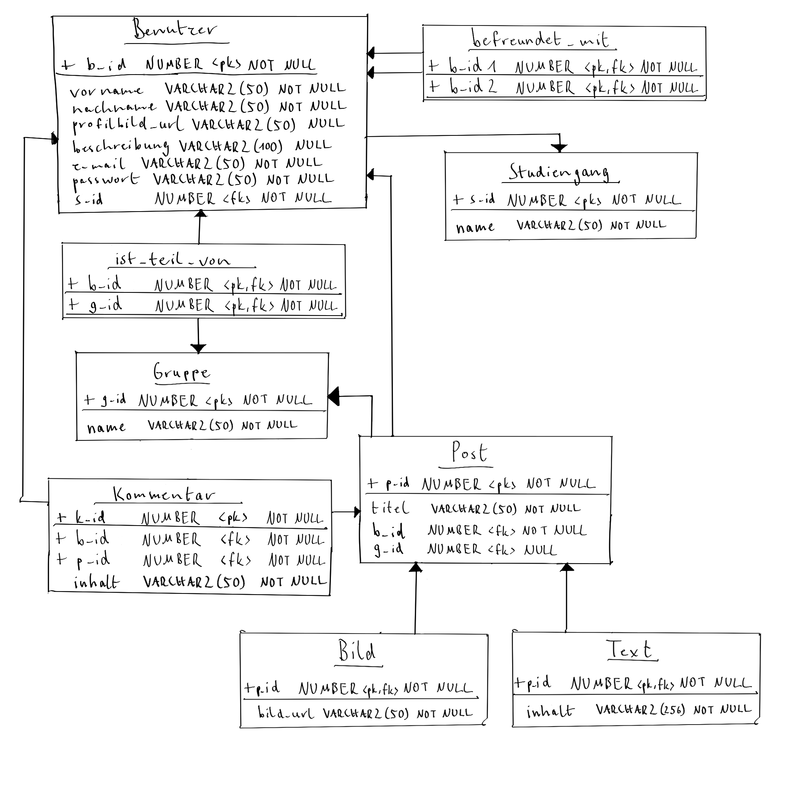

# Projektübersicht SGD Praktikum Team 28

Dies ist das Repository zur Bearbeitung des Praktikums des Moduls SGD an der TH Köln im Sommersemester 2023

## Inhalt
- [MS1](./src/main/ms1)
  - Projektkonzept als PDF
  - SQL-Script mit Beispieldatensätzen

## Projektkonzept
Im Ordner zum MS1 findet man das Projektkonzept auch zusätzlich als PDF-Datei

### Teamvorstellung
- Carina Wall (inf2506) - Teamleiter
- Junis El Ahmad (inf2397)
- Laura Zinn (inf 2395)

### Projektidee - Social-Media-App für die Studenten der TH Köln

#### Ziele
- Vernetzung der Studenten
- Erleichterte Kommunikation zwischen Kommilitonen

#### Typische Arbeitsabläufe
- Account erstellen
- nach Benutzer suchen
- Post erstellen
  - verschiedene Postarten z.B. Text oder Bild
  - in einer Gruppe posten oder öffentlich
- Post kommentieren
- Gruppe erstellen

#### ER-Diagramm

#### Relationenmodell

#### PL/SQL - Übersicht

| Student | Prozedur / Funktion | Trigger   |
| --- |---------------------|-----------|
| Carina Wall | (3)                 | (4) / (5) |
| Junis El Ahmad | (1)                 | (3)       |
| Laura Zinn | (2)                 | (1) / (2) |

#### Prozeduren / Funktionen
1. Automatische Erstellung und Hinzufügen von Gruppen für einzelne Studiengänge
2. Suchen / Filtern von anderen Benutzern
3. Alle Benutzer mit denen man befreundet ist / mit denen man in einer Gruppe ist ausgeben

#### Trigger
1. Bei Erstellen eines Accounts testen, ob E-Mail von der TH ist (@webmail.th-koeln.de)
2. Bei Erstellen eines Accounts testen, ob Passwort die Bedingungen erfüllt (bspw. 3 Zahlen, 1 Sonderzeichen)
3. Bei Erstellen eines Accounts eine Willkommens-Message senden
4. Bei Löschung eines Accounts alle Posts des Benutzers löschen
5. Bei Löschung eines Accounts alle Freundschaftsbeziehungen des Benutzers löschen